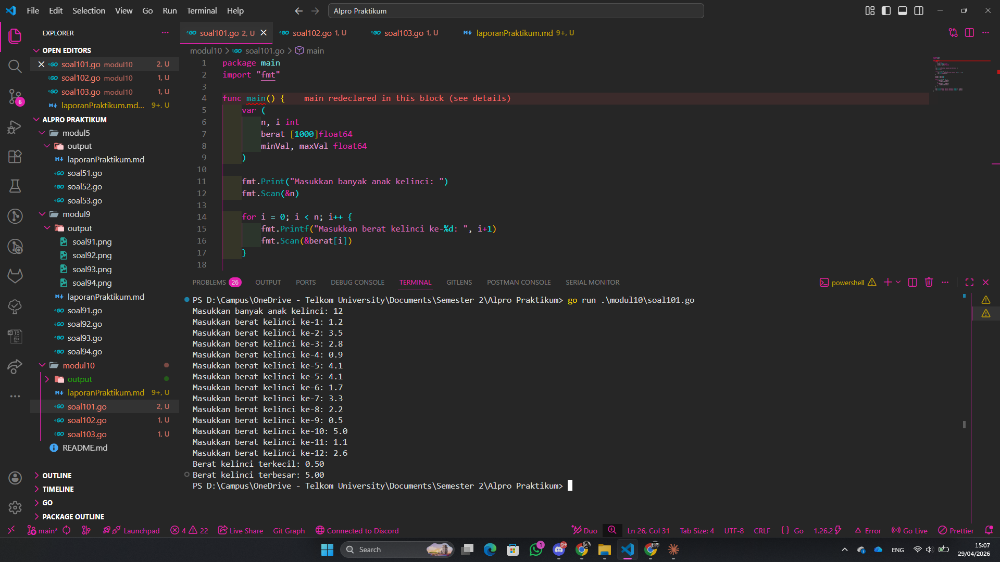
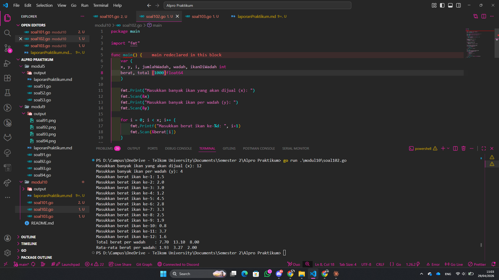
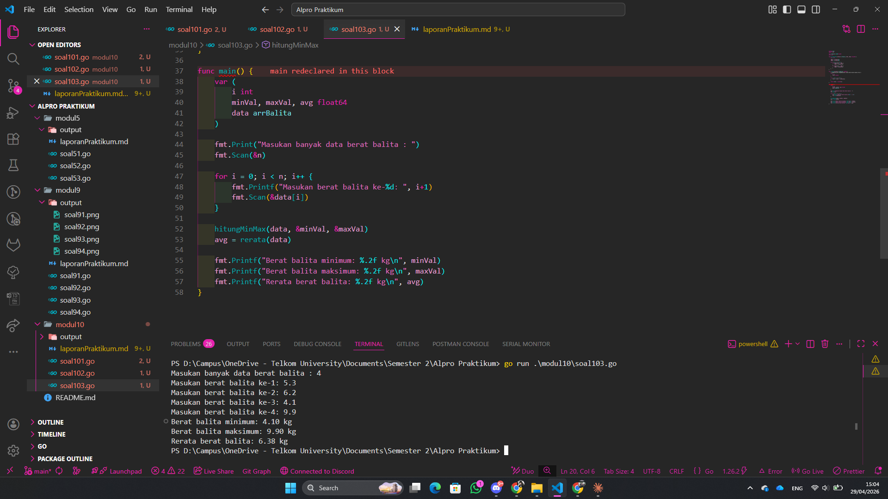

# <h1 align="center">Laporan Praktikum Modul 10 - Pencarian Nilai Min / Max </h1>
<p align="center">Muhammad Najmi - 109082500031</p>


## 1. Soal Latihan Modul 10.1
Sebuah program digunakan untuk mendata berat anak kelinci yang akan dijual ke pasar. Program ini menggunakan array dengan kapasitas 1000 untuk menampung data berat anak kelinci yang akan dijual.

### soal101.go

```go
package main
import "fmt"

func main() {
	var (
		n, i int
		berat [1000]float64
		minVal, maxVal float64
	)

	fmt.Print("Masukkan banyak anak kelinci: ")
	fmt.Scan(&n)

	for i = 0; i < n; i++ {
		fmt.Printf("Masukkan berat kelinci ke-%d: ", i+1)
		fmt.Scan(&berat[i])
	}

	minVal = berat[0]
	maxVal = berat[0]

	for i = 1; i < n; i++ {
		if berat[i] < minVal {
			minVal = berat[i]
		}
		if berat[i] > maxVal {
			maxVal = berat[i]
		}
	}

	fmt.Printf("Berat kelinci terkecil: %.2f\n", minVal)
	fmt.Printf("Berat kelinci terbesar: %.2f\n", maxVal)
}
```

### Output 



Program ini memiliki 2 variable integer yaitu n dan i, 1 variable array float64 berkapasitas 1000 yaitu berat, serta 2 variable float64 yaitu minVal dan maxVal. Sistem kerja dari program ini adalah, pengguna memasukan nilai n sebagai banyaknya anak kelinci, setelah itu program melakukan perulangan sebanyak n kali untuk meminta pengguna memasukan berat setiap kelinci ke dalam array berat. Setelah semua data dimasukan, minVal dan maxVal diinisialisasi dengan nilai berat[0]. Program kemudian melakukan perulangan mulai dari indeks 1, di dalam perulangan tersebut terdapat kondisi apabila berat[i] lebih kecil dari minVal maka minVal diperbarui dengan berat[i], dan apabila berat[i] lebih besar dari maxVal maka maxVal diperbarui dengan berat[i]. Setelah perulangan selesai, program menampilkan nilai minVal sebagai berat kelinci terkecil dan maxVal sebagai berat kelinci terbesar.


## 2. Soal Latihan Modul 10.2
Sebuah program digunakan untuk menentukan tarif ikan yang akan dijual ke pasar. Program ini menggunakan array dengan kapasitas 1000 untuk menampung data berat ikan yang akan dijual.

### soal102.go

```go
package main
import "fmt"

func main() {
	var (
    x, y, i, jumlahWadah, wadah, ikanDiWadah int
    berat, total [1000]float64
	)
	fmt.Print("Masukkan banyak ikan yang akan dijual (x): ")
	fmt.Scan(&x)
	fmt.Print("Masukkan banyak ikan per wadah (y): ")
	fmt.Scan(&y)

	for i = 0; i < x; i++ {
		fmt.Printf("Masukkan berat ikan ke-%d: ", i+1)
		fmt.Scan(&berat[i])
	}

	jumlahWadah = x / y
	if x%y != 0 {
		jumlahWadah = jumlahWadah + 1
	}

	for i = 0; i < x; i++ {
		wadah = i / y
		total[wadah] = total[wadah] + berat[i]
	}

	fmt.Print("Total berat per wadah    : ")
	for i = 0; i < jumlahWadah; i++ {
		if i > 0 {
			fmt.Print("  ")
		}
		fmt.Printf("%.2f", total[i])
	}
	fmt.Println()

	fmt.Print("Rata-rata berat per wadah: ")
	for i = 0; i < jumlahWadah; i++ {
		if (i+1)*y <= x {
			ikanDiWadah = y
		} else {
			ikanDiWadah = x - i*y
		}
		if i > 0 {
			fmt.Print("  ")
		}
		fmt.Printf("%.2f", total[i]/float64(ikanDiWadah))
	}
	fmt.Println()
}
```
### Output:




Program ini memiliki 5 variable integer yaitu x, y, i, jumlahWadah, wadah, dan ikanDiWadah, serta 2 variable array float64 berkapasitas 1000 yaitu berat dan total. Sistem kerja dari program ini adalah, pengguna memasukan nilai x sebagai banyaknya ikan yang akan dijual dan nilai y sebagai banyaknya ikan per wadah, setelah itu program melakukan perulangan sebanyak x kali untuk meminta pengguna memasukan berat setiap ikan ke dalam array berat. Program kemudian menghitung jumlahWadah dengan membagi x dengan y, apabila x tidak habis dibagi y maka jumlahWadah ditambah 1. Setelah itu program melakukan perulangan sebanyak x kali, di dalam perulangan tersebut program menghitung indeks wadah dari setiap ikan dengan membagi i dengan y, lalu menambahkan berat ikan tersebut ke dalam total wadah yang sesuai. Program kemudian menampilkan total berat setiap wadah pada baris pertama, lalu pada baris kedua program melakukan perulangan sebanyak jumlahWadah, di dalam perulangan tersebut terdapat kondisi apabila wadah masih penuh maka ikanDiWadah diisi dengan y, apabila tidak maka ikanDiWadah diisi dengan sisa ikan, setelah itu program menampilkan rata-rata berat ikan di setiap wadah.


## 3. Soal Latihan Modul 10.3
Pos Pelayanan Terpadu (posyandu) sebagai tempat pelayanan kesehatan perlu mencatat data berat balita (dalam kg). Petugas akan memasukkan data tersebut ke dalam array. Dari data yang diperoleh akan dicari berat balita terkecil, terbesar, dan reratanya.

### soal103.go

```go
package main
import "fmt"

type arrBalita [100]float64
var n int

func hitungMinMax(arrBerat arrBalita, bMin, bMax *float64) {
	var i int

	*bMin = arrBerat[0]
	*bMax = arrBerat[0]

	for i = 1; i < n; i++ {
		if arrBerat[i] < *bMin {
			*bMin = arrBerat[i]
		}
		if arrBerat[i] > *bMax {
			*bMax = arrBerat[i]
		}
	}
}

func rerata(arrBerat arrBalita) float64 {
	var (
		i int
		total float64
	)
	for i = 0; i < n; i++ {
		total = total + arrBerat[i]
	}

	return total / float64(n)
}

func main() {
	var (
		i int
		minVal, maxVal, avg float64
		data arrBalita
	)

	fmt.Print("Masukan banyak data berat balita : ")
	fmt.Scan(&n)

	for i = 0; i < n; i++ {
		fmt.Printf("Masukan berat balita ke-%d: ", i+1)
		fmt.Scan(&data[i])
	}

	hitungMinMax(data, &minVal, &maxVal)
	avg = rerata(data)

	fmt.Printf("Berat balita minimum: %.2f kg\n", minVal)
	fmt.Printf("Berat balita maksimum: %.2f kg\n", maxVal)
	fmt.Printf("Rerata berat balita: %.2f kg\n", avg)
}
```
## Output:



Program ini memiliki 1 tipe data array float64 berkapasitas 100 yaitu arrBalita, 1 variable integer global yaitu n, serta 2 fungsi yaitu hitungMinMax dan rerata. Sistem kerja dari program ini adalah, fungsi hitungMinMax menerima parameter array arrBerat bertipe arrBalita dan 2 pointer float64 yaitu bMin dan bMax, di dalam fungsi tersebut bMin dan bMax diinisialisasi dengan arrBerat[0], kemudian program melakukan perulangan mulai dari indeks 1, apabila arrBerat[i] lebih kecil dari nilai yang ditunjuk bMin maka nilai yang ditunjuk bMin diperbarui, apabila arrBerat[i] lebih besar dari nilai yang ditunjuk bMax maka nilai yang ditunjuk bMax diperbarui. Selanjutnya fungsi rerata menerima parameter array arrBerat bertipe arrBalita dan mengembalikan nilai float64, di dalam fungsi tersebut program melakukan perulangan sebanyak n kali untuk menjumlahkan seluruh isi array ke dalam variable total, setelah perulangan selesai fungsi mengembalikan hasil pembagian total dengan n. Pada fungsi main, program meminta pengguna memasukan nilai n sebagai banyaknya data balita, setelah itu program melakukan perulangan sebanyak n kali untuk meminta pengguna memasukan berat setiap balita ke dalam array data. Program kemudian memanggil fungsi hitungMinMax dengan argumen data, alamat minVal, dan alamat maxVal, lalu memanggil fungsi rerata dengan argumen data dan hasilnya disimpan ke avg. Setelah itu program menampilkan nilai minVal sebagai berat minimum, maxVal sebagai berat maksimum, dan avg sebagai rerata berat balita.
