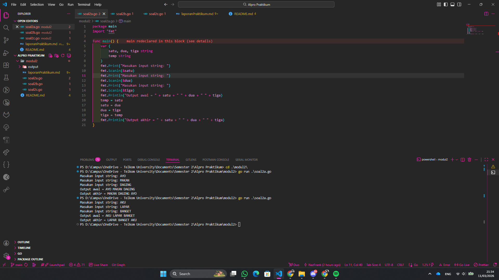
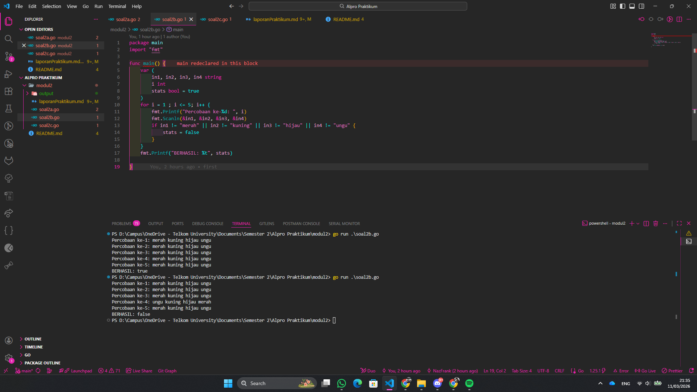
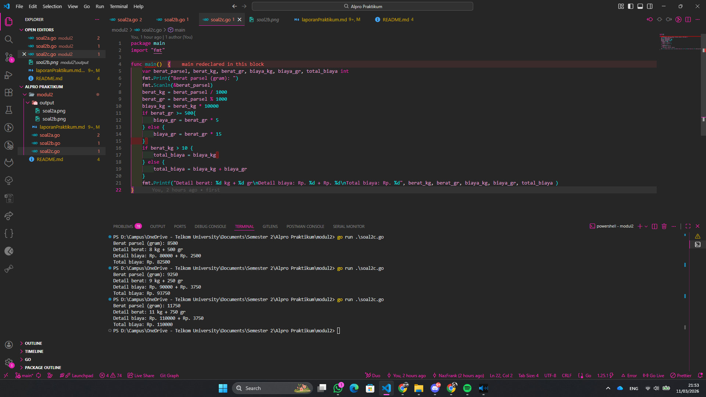

# <h1 align="center">Laporan Praktikum Modul 2 - REVIEW ALGORITMA DAN PEMROGRAMAN 1 </h1>
<p align="center">Muhammad Najmi - 109082500031</p>


## 1. Soal Latihan Modul 2A
### soal2a.go

```go
package main
import "fmt"

func main() {
	var (
		satu, dua, tiga string
		temp string
	)
	fmt.Print("Masukan input string: ")
	fmt.Scanln(&satu)
	fmt.Print("Masukan input string: ")
	fmt.Scanln(&dua)
	fmt.Print("Masukan input string: ")
	fmt.Scanln(&tiga)
	fmt.Println("Output awal = " + satu + " " + dua + " " + tiga)
	temp = satu
	satu = dua
	dua = tiga
	tiga = temp
	fmt.Println("Output akhir = " + satu + " " + dua + " " + tiga)
}
```

### Output 


```
Program ini memiliki 3 variable string inputan serta 1 variable string kosong. Sistem kerja dari program ini adalah, pengguna memasukan isi pada variable satu, setelah itu memasukan isi pada vairable dua, hingga memasukan isi pada variable tiga. Program akan menampilkan isi dari semua variable dan melakukan proses pertukaran isi, dari variable temp diisi oleh isi variable satu, setelah itu dari variable satu diisi oleh isi variable dua, setelah itu dari variable dua diisi oleh isi variable tiga, setelah itu dari variable isi diisi oleh isi variable temp. Setelah perubahan isi program akan menampilkan hasil pertukaran isi variable dari program tersebut.  
```

## 2. Soal Latihan Modul 2B
### soal2b.go

```go
package main
import "fmt"

func main() {
	var (
		in1, in2, in3, in4 string
		i int
		stats bool = true
	)
	for i = 1 ; i <= 5; i++ {
		fmt.Printf("Percobaan ke-%d: ", i)
		fmt.Scanln(&in1, &in2, &in3, &in4)
		if in1 != "merah" || in2 != "kuning" || in3 != "hijau" || in4 != "ungu" {
			stats = false
		}
	}
	fmt.Printf("BERHASIL: %t", stats)

}
```
### Output:



```
Program ini memiliki 4 variable string, 1 variable integer, dan 1 variable boolean. Sistem berjalan dari program ini adalah, program akan melakukan perulangan sebanyak 5 kali, disitu program meminta pengguna untuk memasukan isi pada variable in1, in2, in3, dan in4 selama perulangan itu berjalan. Ada sebuah kondisi di dalam proses perulangan kalau variable in1 diisi selain merah, atau variable in2 diisi selain kuning, atau variable in3 diisi selain hijau, atau variable in4 diisi selain ungu maka isi variable stats berubah menjadi false. Setelah perulangan selesai maka program akan menampilkan isi dari variable stats.
```

## 3. Soal Latihan Modul 2C
### soal2c.go

```go
package main
import "fmt"

func main()  {
	var berat_parsel, berat_kg, berat_gr, biaya_kg, biaya_gr, total_biaya int
	fmt.Print("Berat parsel (gram): ")
	fmt.Scanln(&berat_parsel)
	berat_kg = berat_parsel / 1000
	berat_gr = berat_parsel % 1000
	biaya_kg = berat_kg * 10000
	if berat_gr >= 500{
		biaya_gr = berat_gr * 5
	} else {
		biaya_gr = berat_gr * 15
 	} 
	if berat_kg > 10 {
		total_biaya = biaya_kg 
	} else {
		total_biaya = biaya_kg + biaya_gr
	}
	fmt.Printf("Detail berat: %d kg + %d gr\nDetail biaya: Rp. %d + Rp. %d\nTotal biaya: Rp. %d", berat_kg, berat_gr, biaya_kg, biaya_gr, total_biaya )
}
```
## Output:


```
Program ini memiliki 6 variable integer. Sistem kerja dari program ini adalah, program meminta pengguna untuk memasukan berat parsel dalam satuan gram yang kemudian disimpan pada variable berat_parsel. Setelah itu program melakukan proses perhitungan untuk mendapatkan berat dalam satuan kilogram dan sisa gramnya, dimana variable berat_kg diisi dari hasil pembagian berat_parsel dengan 1000, dan variable berat_gr diisi dari hasil sisa pembagian berat_parsel dengan 1000. Setelah itu program melakukan proses perhitungan biaya berdasarkan berat kilogram, dimana variable biaya_kg diisi dari hasil perkalian berat_kg dengan 10000. Selanjutnya terdapat kondisi yang memeriksa sisa berat gram, jika berat_gr lebih besar atau sama dengan 500 maka variable biaya_gr diisi dari hasil perkalian berat_gr dengan 5, tetapi jika berat_gr kurang dari 500 maka variable biaya_gr diisi dari hasil perkalian berat_gr dengan 15. Setelah proses tersebut terdapat kondisi lain yang memeriksa apakah berat dalam kilogram lebih dari 10, jika berat_kg lebih dari 10 maka variable total_biaya hanya diisi dengan nilai dari biaya_kg, tetapi jika tidak maka variable total_biaya diisi dari hasil penjumlahan antara biaya_kg dan biaya_gr. Setelah semua proses perhitungan selesai program akan menampilkan detail berat parsel dalam kilogram dan gram, detail biaya yang dihitung dari kilogram dan gram, serta total biaya yang harus dibayar.
```