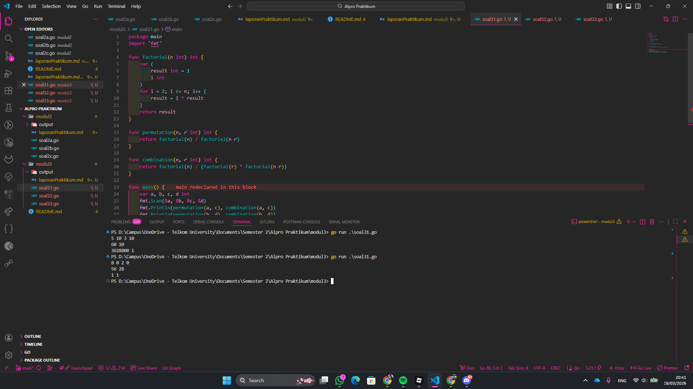
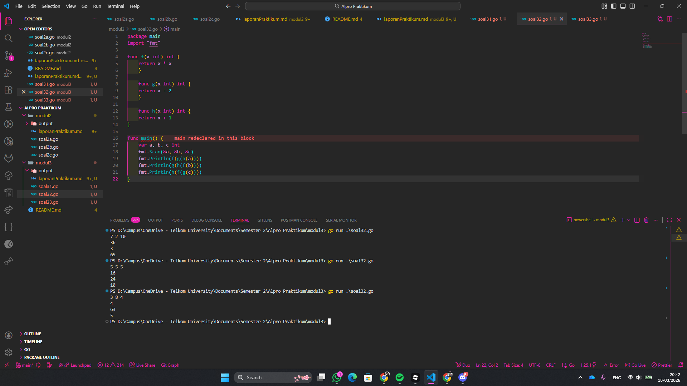
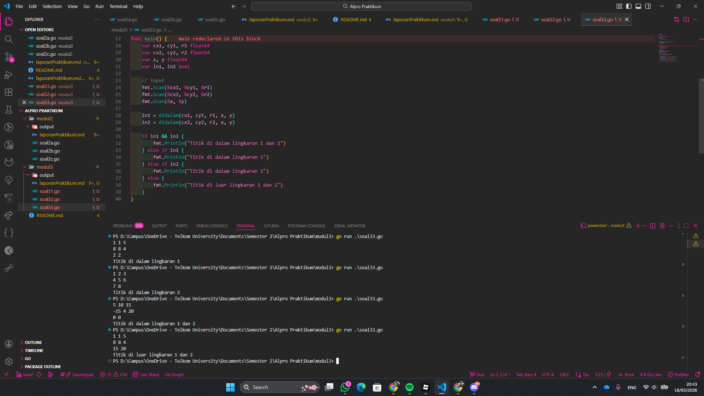

# <h1 align="center">Laporan Praktikum Modul 3 - Function </h1>
<p align="center">Muhammad Najmi - 109082500031</p>


## 1. Soal Latihan Modul 3.1
Minggu ini, mahasiswa Fakultas Informatika mendapatkan tugas dari mata kuliah matematika diskrit untuk mempelajari kombinasi dan permutasi. Jonas salah seorang mahasiswa, iseng untuk mengimplementasikannya ke dalam suatu program.

### soal31.go

```go
package main
import "fmt"

func factorial(n int) int {
	var (
		result int = 1
		i int
	)
	for i = 2; i <= n; i++ {
		result = i * result
	}
	return result
}

func permutation(n, r int) int {
	return factorial(n) / factorial(n-r)
}

func combination(n, r int) int {
	return factorial(n) / (factorial(r) * factorial(n-r))
}

func main() {
	var a, b, c, d int
	fmt.Scan(&a, &b, &c, &d)
	fmt.Println(permutation(a, c), combination(a, c))
	fmt.Println(permutation(b, d), combination(b, d))
}
```

### Output 



Program ini memiliki 4 variable integer sebagai inputan yaitu a, b, c, dan d, serta memiliki 3 fungsi yaitu factorial, permutation, dan combination. Sistem kerja dari program ini adalah, fungsi factorial digunakan untuk menghitung nilai faktorial dari suatu bilangan dengan perulangan dari 2 sampai n, dimana setiap perulangan nilai result akan dikalikan dengan i hingga menghasilkan nilai faktorial. Selanjutnya terdapat fungsi permutation yang digunakan untuk menghitung permutasi dengan rumus factorial(n) dibagi factorial(n-r). Setelah itu terdapat fungsi combination yang digunakan untuk menghitung kombinasi dengan rumus factorial(n) dibagi hasil perkalian factorial(r) dan factorial(n-r). Pada fungsi main, program akan meminta pengguna memasukan nilai a, b, c, dan d. Setelah itu program akan menampilkan hasil permutasi dan kombinasi dari a dan c, kemudian menampilkan hasil permutasi dan kombinasi dari b dan d.


## 2. Soal Latihan Modul 3.2
Diberikan tiga buah fungsi matematika yaitu f (x) = x^2 , g (x) = x − 2 dan h (x) = x + 1. Fungsi komposisi (fogoh)(x) artinya adalah f(g(h(x))). Tuliskan f(x), g(x) dan h(x) dalam bentuk function.

### soal32.go

```go
package main
import "fmt"

func f(x int) int {
	return x * x
	}

	func g(x int) int {
	return x - 2
	}

	func h(x int) int {
	return x + 1
}

func main() {
	var a, b, c int
	fmt.Scan(&a, &b, &c)
	fmt.Println(f(g(h(a))))
	fmt.Println(g(h(f(b))))
	fmt.Println(h(f(g(c))))
}
```
### Output:




Program ini memiliki 3 variable integer sebagai inputan yaitu a, b, dan c, serta memiliki 3 fungsi yaitu f, g, dan h. Sistem kerja dari program ini adalah, fungsi f digunakan untuk mengembalikan nilai kuadrat dari x, fungsi g digunakan untuk mengurangi nilai x dengan 2, dan fungsi h digunakan untuk menambahkan nilai x dengan 1. Pada fungsi main, program akan meminta pengguna memasukan nilai ke dalam variable a, b, dan c. Setelah itu program akan menampilkan hasil dari proses pemanggilan fungsi secara berurutan yaitu f(g(h(a))), kemudian g(h(f(b))), dan terakhir h(f(g(c))), dimana setiap fungsi akan diproses dari bagian paling dalam terlebih dahulu hingga menghasilkan nilai akhir.


## 3. Soal Latihan Modul 3.3
[Lingkaran] Suatu lingkaran didefinisikan dengan koordinat titik pusat (cx, cy) dengan radius r. Apabila diberikan dua buah lingkaran, maka tentukan posisi sebuah titik sembarang (x,y) berdasarkan dua lingkaran tersebut.

### soal33.go

```go
package main
import "fmt"

func jarak(a, b, c, d float64) float64 {
	var dx, dy float64
	dx = a - c
	dy = b - d
	return dx*dx + dy*dy
}

func didalam(cx, cy, r, x, y float64) bool {
	var hasil bool
	hasil = jarak(x, y, cx, cy) <= r*r
	return hasil
}

func main() {
	var cx1, cy1, r1 float64
	var cx2, cy2, r2 float64
	var x, y float64
	var in1, in2 bool

	// input
	fmt.Scan(&cx1, &cy1, &r1)
	fmt.Scan(&cx2, &cy2, &r2)
	fmt.Scan(&x, &y)

	in1 = didalam(cx1, cy1, r1, x, y)
	in2 = didalam(cx2, cy2, r2, x, y)

	if in1 && in2 {
		fmt.Println("Titik di dalam lingkaran 1 dan 2")
	} else if in1 {
		fmt.Println("Titik di dalam lingkaran 1")
	} else if in2 {
		fmt.Println("Titik di dalam lingkaran 2")
	} else {
		fmt.Println("Titik di luar lingkaran 1 dan 2")
	}
}
```
## Output:



Program ini memiliki beberapa variable float64 yaitu cx1, cy1, r1, cx2, cy2, r2, x, dan y, serta memiliki 2 variable boolean yaitu in1 dan in2. Selain itu program memiliki 2 fungsi yaitu jarak dan didalam. Sistem kerja dari program ini adalah, fungsi jarak digunakan untuk menghitung jarak kuadrat antara dua titik, dimana nilai dx diisi dari selisih a dan c, dan dy diisi dari selisih b dan d, kemudian fungsi mengembalikan hasil dxdx + dydy. Selanjutnya terdapat fungsi didalam yang digunakan untuk mengecek apakah suatu titik berada di dalam lingkaran, dimana fungsi ini membandingkan hasil dari jarak titik ke pusat lingkaran dengan r*r, jika kurang dari sama dengan maka bernilai true. Pada fungsi main, program akan meminta pengguna memasukan data lingkaran pertama, lingkaran kedua, serta titik x dan y. Setelah itu program akan memanggil fungsi didalam untuk masing-masing lingkaran dan menyimpan hasilnya ke dalam variable in1 dan in2. Selanjutnya terdapat kondisi, jika in1 dan in2 bernilai true maka program menampilkan titik berada di dalam lingkaran 1 dan 2, jika hanya in1 true maka di dalam lingkaran 1, jika hanya in2 true maka di dalam lingkaran 2, dan jika keduanya false maka titik berada di luar kedua lingkaran.
