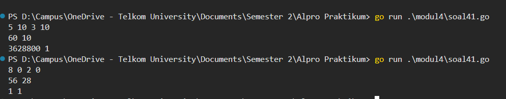
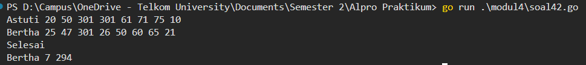

# <h1 align="center">Laporan Praktikum Modul 4 - Prosedur </h1>
<p align="center">Muhammad Najmi - 109082500031</p>


## 1. Soal Latihan Modul 4.1
Minggu ini, mahasiswa Fakultas Informatika mendapatkan tugas dari mata kuliah matematika diskrit untuk mempelajari kombinasi dan permutasi. Jonas salah seorang mahasiswa, iseng untuk mengimplementasikannya ke dalam suatu program. Oleh karena itu bersediakah kalian membantu Jonas?

### soal41.go

```go
package main

import "fmt"

func factorial(n int, hasil *int) {
	*hasil = 1
	for i := 1; i <= n; i++ {
		*hasil *= i
	}
}

func permutation(n, r int, hasil *int) {
	var factN, factNR int
	factorial(n, &factN)
	factorial(n-r, &factNR)
	*hasil = factN / factNR
}

func combination(n, r int, hasil *int) {
	var factN, factR, factNR int
	factorial(n, &factN)
	factorial(r, &factR)
	factorial(n-r, &factNR)
	*hasil = factN / (factR * factNR)
}

func main() {
	var a, b, c, d int
	fmt.Scan(&a, &b, &c, &d)

	var p, k int
	permutation(a, c, &p)
	combination(a, c, &k)
	fmt.Println(p, k)

	permutation(b, d, &p)
	combination(b, d, &k)
	fmt.Println(p, k)
}
```

### Output 



Program ini memiliki 4 variable integer sebagai inputan yaitu a, b, c, dan d, serta 2 variable integer untuk menampung hasil yaitu p dan k, dan memiliki 3 prosedur yaitu factorial, permutation, dan combination. Sistem kerja dari program ini adalah, prosedur factorial digunakan untuk menghitung nilai faktorial dari suatu bilangan n dengan perulangan dari 1 sampai n, dimana setiap perulangan nilai hasil akan dikalikan dengan i hingga menghasilkan nilai faktorial, dan hasilnya dikembalikan melalui parameter pass by reference menggunakan pointer. Selanjutnya terdapat prosedur permutation yang digunakan untuk menghitung permutasi dengan cara memanggil prosedur factorial sebanyak dua kali yaitu untuk menghitung factorial(n) dan factorial(n-r), kemudian hasil permutasi didapat dari pembagian factN dengan factNR dan dikembalikan melalui pointer. Setelah itu terdapat prosedur combination yang digunakan untuk menghitung kombinasi dengan cara memanggil prosedur factorial sebanyak tiga kali yaitu untuk menghitung factorial(n), factorial(r), dan factorial(n-r), kemudian hasil kombinasi didapat dari pembagian factN dengan hasil perkalian factR dan factNR dan dikembalikan melalui pointer. Pada fungsi main, program akan meminta pengguna memasukan nilai a, b, c, dan d. Setelah itu program memanggil prosedur permutation dan combination dengan argumen a dan c, kemudian menampilkan hasil permutasi dan kombinasi dari a terhadap c. Selanjutnya program memanggil prosedur permutation dan combination dengan argumen b dan d, kemudian menampilkan hasil permutasi dan kombinasi dari b terhadap d.


## 2. Soal Latihan Modul 4.2
Kompetisi pemrograman tingkat nasional berlangsung ketat. Setiap peserta diberikan 8 soal yang harus dapat diselesaikan dalam waktu 5 jam saja. Peserta yang berhasil menyelesaikan soal paling banyak dalam waktu paling singkat adalah pemenangnya. Buat program gema yang mencari pemenang dari daftar peserta yang diberikan. Program harus dibuat modular, yaitu dengan membuat prosedur hitungSkor yang mengembalikan total soal dan total skor yang dikerjakan oleh seorang peserta, melalui parameter formal. Pembacaan nama peserta dilakukan di program utama, sedangkan waktu pengerjaan dibaca di dalam prosedur.
### soal32.go

```go
package main

import "fmt"

func hitungSkor(soal, skor *int) {
	var waktu int
	*soal = 0
	*skor = 0
	for i := 1; i <= 8; i++ {
		fmt.Scan(&waktu)
		if waktu <= 300 {
			*soal++
			*skor += waktu
		}
	}
}

func main() {
	var nama, pemenang string
	var soal, skor, maxSoal, minSkor int

	maxSoal = -1
	minSkor = 0

	fmt.Scan(&nama)
	for nama != "Selesai" {
		hitungSkor(&soal, &skor)

		if soal > maxSoal || (soal == maxSoal && skor < minSkor) {
			pemenang = nama
			maxSoal = soal
			minSkor = skor
		}

		fmt.Scan(&nama)
	}

	fmt.Println(pemenang, maxSoal, minSkor)
}
```
### Output:




Program ini memiliki 2 variable string yaitu nama dan pemenang, serta 4 variable integer yaitu soal, skor, maxSoal, dan minSkor, dan memiliki 1 prosedur yaitu hitungSkor. Sistem kerja dari program ini adalah, prosedur hitungSkor digunakan untuk membaca 8 buah waktu pengerjaan soal dan menghitung total soal yang berhasil diselesaikan serta total waktu pengerjaannya, dimana di dalam prosedur terdapat perulangan sebanyak 8 kali yang membaca nilai waktu, jika waktu kurang dari atau sama dengan 300 maka soal bertambah 1 dan skor ditambah dengan waktu tersebut, dan hasilnya dikembalikan melalui parameter pass by reference menggunakan pointer. Pada fungsi main, program akan meminta pengguna memasukan nama peserta, selama nama yang dimasukan bukan "Selesai" maka program akan memanggil prosedur hitungSkor untuk menghitung jumlah soal dan skor peserta tersebut. Setelah itu program melakukan pengecekan, jika jumlah soal peserta saat ini lebih banyak dari maxSoal, atau jumlah soal sama tetapi skor lebih kecil dari minSkor, maka variable pemenang diisi dengan nama peserta tersebut, maxSoal diisi dengan jumlah soal, dan minSkor diisi dengan skor. Setelah semua peserta selesai diproses, program akan menampilkan nama pemenang, jumlah soal yang diselesaikan, dan total waktu pengerjaannya.
