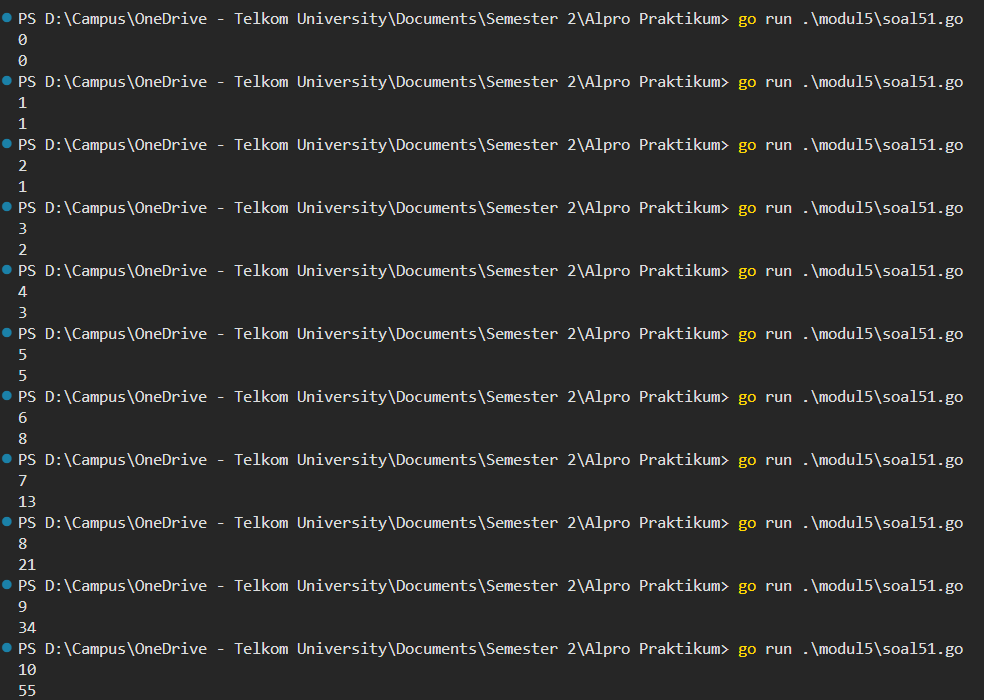
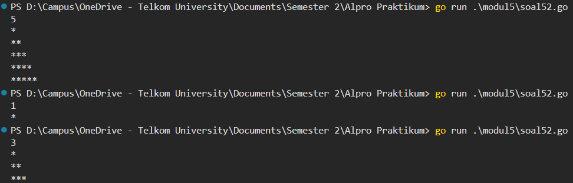
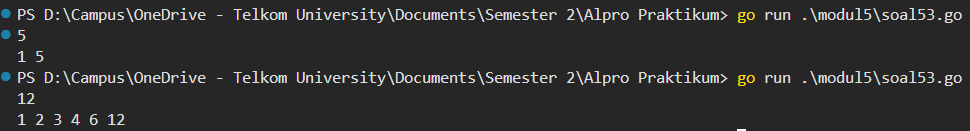

# <h1 align="center">Laporan Praktikum Modul 5 - Rekursif </h1>
<p align="center">Muhammad Najmi - 109082500031</p>


## 1. Soal Latihan Modul 5.1
Deret fibonacci adalah sebuah deret dengan nilai suku ke-0 dan ke-1 adalah 0 dan 1, dan nilai suku ke-n selanjutnya adalah hasil penjumlahan dua suku sebelumnya. Secara umum dapat diformulasikan Sn = Sn−1 + Sn−2 . Berikut ini adalah contoh nilai deret fibonacci hingga suku ke-10. Buatlah program yang mengimplementasikan fungsi rekursif pada deret fibonacci tersebut.

### soal51.go

```go
package main

import "fmt"

func fibonacci(n int) int {
	if n == 0 {
		return 0
	} else if n == 1 {
		return 1
	} else {
		return fibonacci(n-1) + fibonacci(n-2)
	}
}

func main() {
	var n int
	fmt.Scan(&n)
	fmt.Println(fibonacci(n))
}
```

### Output 



Program ini memiliki 1 variable integer sebagai inputan yaitu n, dan memiliki 1 fungsi rekursif yaitu fibonacci. Sistem kerja dari program ini adalah, fungsi fibonacci digunakan untuk menghitung nilai suku ke-n dari deret fibonacci secara rekursif, dimana base-case dari fungsi ini adalah ketika n sama dengan 0 maka fungsi mengembalikan nilai 0, dan ketika n sama dengan 1 maka fungsi mengembalikan nilai 1. Pada recursive-case, fungsi mengembalikan hasil penjumlahan dari pemanggilan fibonacci(n-1) dan fibonacci(n-2), dimana setiap pemanggilan akan terus dipecah menjadi sub-masalah yang lebih kecil hingga mencapai base-case. Pada fungsi main, program akan meminta pengguna memasukan nilai n, setelah itu program memanggil fungsi fibonacci dengan argumen n dan menampilkan hasilnya.


## 2. Soal Latihan Modul 3.2
Buatlah sebuah program yang digunakan untuk menampilkan pola bintang berikut ini dengan menggunakan fungsi rekursif. N adalah masukan dari user.

### soal52.go

```go
package main

import "fmt"

func cetakBaris(n int) {
	if n == 0 {
		return
	}
	fmt.Print("*")
	cetakBaris(n - 1)
}

func polaBintang(baris, n int) {
	if baris > n {
		return
	}
	cetakBaris(baris)
	fmt.Println()
	polaBintang(baris+1, n)
}

func main() {
	var n int
	fmt.Scan(&n)
	polaBintang(1, n)
}
```
### Output:




Program ini memiliki 1 variable integer sebagai inputan yaitu n, dan memiliki 2 prosedur rekursif yaitu cetakBaris dan polaBintang. Sistem kerja dari program ini adalah, prosedur cetakBaris digunakan untuk mencetak karakter bintang sebanyak n kali secara rekursif, dimana base-case dari prosedur ini adalah ketika n sama dengan 0 maka prosedur berhenti dan tidak mencetak apapun, pada recursive-case prosedur mencetak satu karakter bintang kemudian memanggil dirinya sendiri dengan argumen n-1. Selanjutnya terdapat prosedur polaBintang yang digunakan untuk mencetak pola bintang secara bertahap dari baris ke-1 hingga baris ke-n, dimana base-case dari prosedur ini adalah ketika baris lebih besar dari n maka prosedur berhenti, pada recursive-case prosedur memanggil cetakBaris dengan argumen baris untuk mencetak bintang sebanyak nomor baris saat itu, kemudian mencetak baris baru dan memanggil dirinya sendiri dengan argumen baris+1. Pada fungsi main, program akan meminta pengguna memasukan nilai n, setelah itu program memanggil prosedur polaBintang dengan argumen 1 dan n untuk memulai pencetakan dari baris pertama.


## 3. Soal Latihan Modul 5.3
Buatlah program yang mengimplementasikan rekursif untuk menampilkan faktor bilangan dari suatu N, atau bilangan yang apa saja yang habis membagi N.

### soal53.go

```go
package main

import "fmt"

func faktor(n, i int) {
	if i > n {
		return
	}
	if n%i == 0 {
		fmt.Print(i, " ")
	}
	faktor(n, i+1)
}

func main() {
	var n int
	fmt.Scan(&n)
	faktor(n, 1)
}
```
## Output:



Program ini memiliki 1 variable integer sebagai inputan yaitu n, dan memiliki 1 prosedur rekursif yaitu faktor. Sistem kerja dari program ini adalah, prosedur faktor digunakan untuk mencari dan mencetak semua bilangan yang menjadi faktor dari n secara rekursif, dimana prosedur menerima dua parameter yaitu n sebagai bilangan yang dicari faktornya dan i sebagai bilangan pembagi yang dimulai dari 1. Base-case dari prosedur ini adalah ketika i lebih besar dari n maka prosedur berhenti. Pada recursive-case, prosedur melakukan pengecekan apakah n habis dibagi i, jika iya maka prosedur mencetak nilai i, setelah itu prosedur memanggil dirinya sendiri dengan argumen n dan i+1 untuk memeriksa bilangan pembagi berikutnya. Pada fungsi main, program akan meminta pengguna memasukan nilai n, setelah itu program memanggil prosedur faktor dengan argumen n dan 1 untuk memulai pencarian faktor dari bilangan 1.
