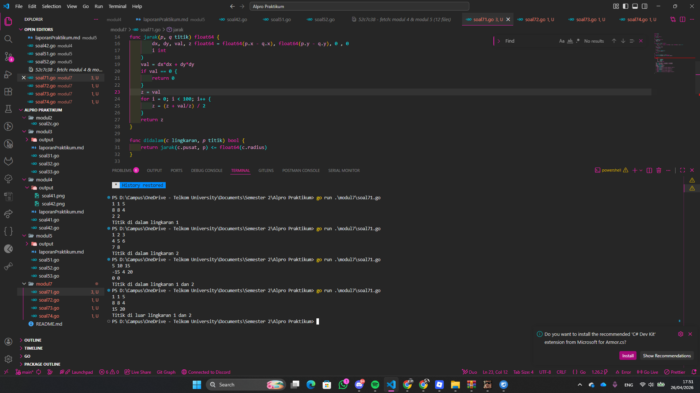
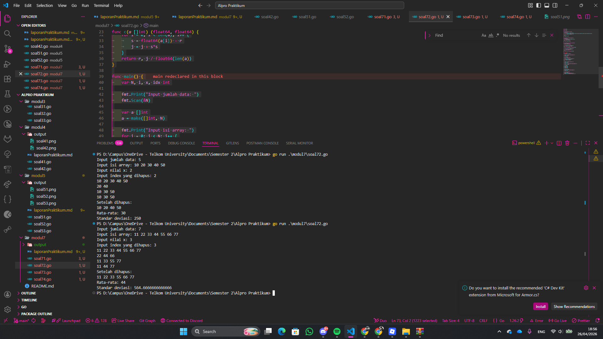
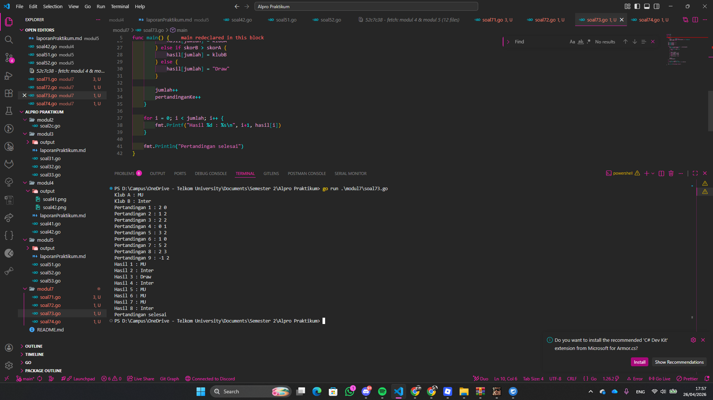
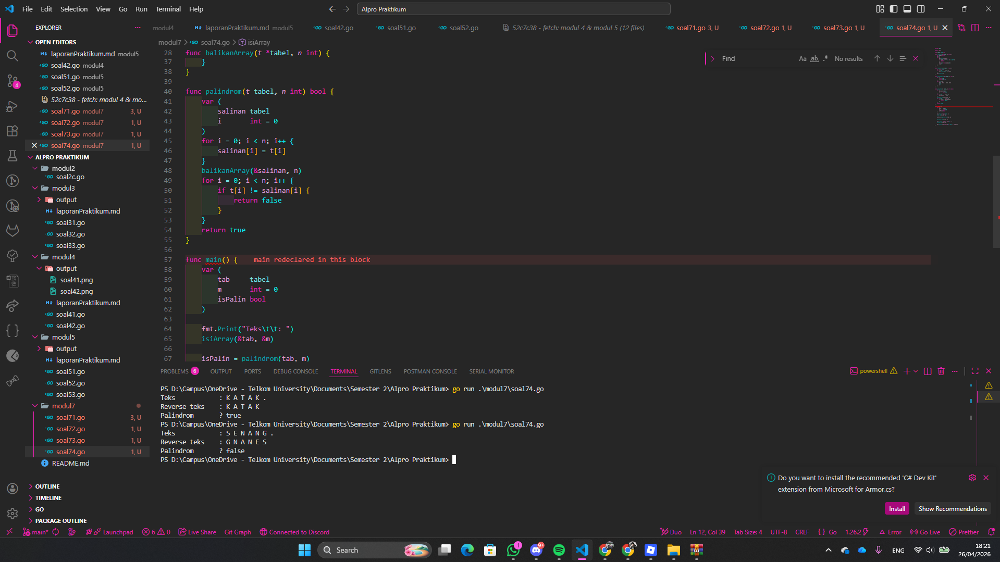

# <h1 align="center">Laporan Praktikum Modul 5 - Rekursif </h1>
<p align="center">Muhammad Najmi - 109082500031</p>


## 1. Soal Latihan Modul 7.1

### soal51.go

```go

```

### Output 



Program ini memiliki 2 tipe bentukan yaitu titik yang menyimpan koordinat x dan y, dan lingkaran yang menyimpan titik pusat dan radius. Program juga memiliki 2 fungsi yaitu jarak dan didalam. Sistem kerja dari program ini adalah, fungsi jarak digunakan untuk menghitung jarak antara dua titik menggunakan rumus Euclidean, dimana karena tidak menggunakan library math maka perhitungan akar kuadrat dilakukan secara manual menggunakan metode Newton-Raphson sebanyak 100 iterasi. Fungsi didalam digunakan untuk menentukan apakah sebuah titik berada di dalam suatu lingkaran, dengan cara membandingkan jarak antara titik tersebut dengan titik pusat lingkaran terhadap radius lingkaran, jika jarak lebih kecil atau sama dengan radius maka fungsi mengembalikan nilai true. Pada fungsi main, program meminta pengguna memasukkan koordinat pusat dan radius dari lingkaran 1 dan lingkaran 2, kemudian meminta koordinat titik sembarang. Setelah itu program memanggil fungsi didalam untuk kedua lingkaran dan menampilkan salah satu dari empat kemungkinan output yaitu titik di dalam lingkaran 1 dan 2, titik di dalam lingkaran 1, titik di dalam lingkaran 2, atau titik di luar lingkaran 1 dan 2.

## 2. Soal Latihan Modul 7.2

### soal72.go

```go
package main

import "fmt"

func t(a []int, m, x int) {
	var i int
	for i = 0; i < len(a); i++ {
		if m == 0 || (m == 1 && i%2 != 0) || (m == 2 && i%2 == 0) || (m == 3 && i%x == 0) {
			fmt.Print(a[i], " ")
		}
	}
	fmt.Println()
}

func h(a []int, idx int) []int {
	var i int
	for i = idx; i < len(a)-1; i++ {
		a[i] = a[i+1]
	}
	return a[:len(a)-1]
}

func c(a []int) (float64, float64) {
	var i, total int
	var r, j, s float64

	for i = 0; i < len(a); i++ {
		total = total + a[i]
	}
	r = float64(total) / float64(len(a))

	for i = 0; i < len(a); i++ {
		s = float64(a[i]) - r
		j = j + s*s
	}
	return r, j / float64(len(a))
}

func main() {
	var N, i, x, idx int

	fmt.Print("Input jumlah data: ")
	fmt.Scan(&N)

	var a []int
	a = make([]int, N)

	fmt.Print("Input isi array: ")
	for i = 0; i < N; i++ {
		fmt.Scan(&a[i])
	}

	fmt.Print("Input nilai x: ")
	fmt.Scan(&x)

	fmt.Print("Input index yang dihapus: ")
	fmt.Scan(&idx)

	// proses
	t(a, 0, 0)
	t(a, 1, 0)
	t(a, 2, 0)
	t(a, 3, x)

	a = h(a, idx)
	fmt.Println("Setelah dihapus:")
	t(a, 0, 0)

	var r, s float64
	r, s = c(a)
	fmt.Println("Rata-rata:", r)
	fmt.Println("Standar deviasi:", s)
}
```
### Output:




Program ini memiliki 1 variable integer sebagai inputan jumlah data yaitu N, dan 1 slice integer yaitu a yang diisi sebanyak N elemen, serta memiliki 3 fungsi yaitu t, h, dan c. Sistem kerja dari program ini adalah, fungsi t digunakan untuk menampilkan elemen-elemen array berdasarkan mode m yang diberikan, dimana jika m sama dengan 0 maka semua elemen ditampilkan, jika m sama dengan 1 maka hanya elemen dengan indeks ganjil yang ditampilkan, jika m sama dengan 2 maka hanya elemen dengan indeks genap yang ditampilkan, dan jika m sama dengan 3 maka hanya elemen dengan indeks kelipatan x yang ditampilkan. Fungsi h digunakan untuk menghapus elemen pada indeks tertentu secara manual dengan cara menggeser semua elemen setelah indeks tersebut satu posisi ke kiri, kemudian mengembalikan slice yang sudah diperpendek satu elemen. Fungsi c digunakan untuk menghitung rata-rata dan varians dari elemen-elemen array, dimana rata-rata dihitung dengan menjumlahkan seluruh elemen dibagi jumlahnya, dan varians dihitung dengan menjumlahkan kuadrat selisih tiap elemen terhadap rata-rata kemudian dibagi jumlah elemen. Pada fungsi main, program meminta pengguna memasukkan jumlah data N, kemudian mengisi slice a sebanyak N elemen, lalu meminta nilai x untuk mode kelipatan dan indeks yang ingin dihapus. Setelah itu program memanggil fungsi t sebanyak 4 kali dengan mode 0 hingga 3 untuk menampilkan elemen sesuai kondisi masing-masing, kemudian memanggil fungsi h untuk menghapus elemen pada indeks yang diinputkan dan menampilkan array setelah penghapusan, terakhir program memanggil fungsi c dan menampilkan hasil rata-rata dan standar deviasinya.

## 3. Soal Latihan Modul 7.3

### soal73.go

```go
```
## Output:



Program ini memiliki 1 array string bernama hasil dengan kapasitas 100 elemen untuk menyimpan hasil tiap pertandingan, serta beberapa variable integer yaitu jumlah, skorA, skorB, pertandinganKe, dan i yang dideklarasikan sekaligus dengan nilai awal, dan 2 variable string yaitu klubA dan klubB. Sistem kerja dari program ini adalah, pertama program meminta pengguna memasukkan nama dua klub yang akan bertanding. Kemudian program masuk ke dalam perulangan untuk meminta input skor tiap pertandingan secara terus-menerus, perulangan berhenti ketika salah satu skor bernilai negatif. Pada setiap pertandingan, program membandingkan skorA dan skorB, jika skorA lebih besar maka nama klubA disimpan ke array hasil, jika skorB lebih besar maka nama klubB yang disimpan, dan jika sama maka disimpan string "Draw". Setelah perulangan selesai, program menampilkan seluruh isi array hasil dari indeks 0 hingga jumlah-1 dengan format "Hasil ke- : nama", kemudian mencetak "Pertandingan selesai".

## 4. Soal Latihan Modul 7.4

### soal74.go

```go

```
## Output:



Program ini memiliki 1 tipe bentukan yaitu tabel yang merupakan array bertipe rune dengan kapasitas 127 elemen, serta memiliki 4 subprogram yaitu isiArray, cetakArray, balikanArray, dan palindrom. Sistem kerja dari program ini adalah, prosedur isiArray digunakan untuk mengisi array tabel dengan karakter yang dimasukkan pengguna satu per satu sebagai token terpisah, perulangan berhenti ketika pengguna memasukkan karakter titik atau array sudah penuh. Prosedur cetakArray digunakan untuk mencetak seluruh isi array tabel dengan spasi antar karakter. Prosedur balikanArray digunakan untuk membalik urutan isi array tabel secara in-place dengan menukar elemen dari posisi paling depan dan paling belakang secara bergantian hingga bertemu di tengah. Fungsi palindrom digunakan untuk memeriksa apakah isi array merupakan palindrom, dengan cara menyalin array ke dalam array salinan kemudian membaliknya menggunakan balikanArray, lalu membandingkan array asli dengan salinan yang sudah dibalik, jika semua elemen sama maka fungsi mengembalikan nilai true. Pada fungsi main, program meminta pengguna memasukkan teks yang diakhiri titik, kemudian mengecek palindrom sebelum array dibalik, lalu membalik array dan menampilkan hasilnya beserta status palindrom.